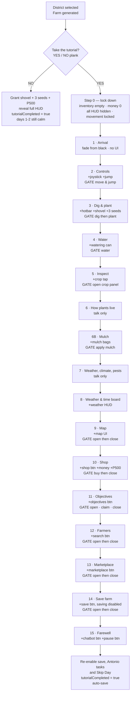

# Beginner Guide — Antonio's Introduction Sequence

**Design script and flow, for review before any code is written.**
AgriDabao 3D · new-player onboarding · 15 steps

---

## 1. What this is

A first-run tutorial in which Antonio — the same neighbour who is already the AI adviser, the daily-task giver and the climate evaluator — walks a new player through every system in the game. It runs once, immediately after district selection and farm generation, and never again for that farm.

It is delivered entirely through a dialogue box with Antonio's portrait. **No 3D Antonio model is needed.** He "arrives", "hands you things" and "walks off" through narration lines, exactly as in the original draft. If a walking Antonio is wanted later it can be added without touching this script.

### Design rules used throughout

| Rule | Reason |
|---|---|
| Nothing is visible until it is taught | The whole point is to stop the player being overwhelmed |
| Every UI element appears **while Antonio names it** | The reveal is the punctuation of the sentence |
| A step that grants an item never also gates on a new action | One new thing at a time |
| Gates use actions the game **already records** | No new instrumentation for the farming steps |
| Dialogue never names a specific crop | The 3 starting seeds are district-random, so "your first crop", never "the corn" |
| The player can always re-read | Back-tap steps one line; gates cannot be skipped |
| **Days 1 and 2 are guaranteed calm** | A typhoon landing mid-tutorial would wipe out the first crop and contradict Antonio mid-sentence |

---

## 2. Dialogue UI

Built from the two sprites already supplied (picture 5): a **portrait frame** on the left and a **plank** to its right, matching the AI chatbot panel's construction.

```
┌────────┐──────────────────────────────────────────────────┐
│        │  ANTONIO                                         │
│ portrait  "Hello! Hey! Over here!"                        │
│  frame │                                          [ tap ▸ ]│
└────────┘──────────────────────────────────────────────────┘
```

- **Anchor** — bottom-centre of the screen, above the hotbar band so it never covers the joystick or the hotbar once those appear.
- **Antonio lines** — name label `Antonio`, portrait swaps to the expression named in the script.
- **Narration lines** — *italic, no name label*. The frame keeps the last expression shown, so his face doesn't flicker between beats.
- **Advance** — tap anywhere on the plank. A small blinking caret sits bottom-right when a line is finished.
- **Typewriter reveal** — ~35 characters/second; tapping mid-line completes the line instantly rather than advancing.
- **While a gate is open** — the box stays on screen showing the instruction line, dimmed slightly, with the caret replaced by a short objective hint (for example *"Dig a planting spot"*). It must not block the part of the screen the player has to touch.

### Expressions

| Expression | Used for | Rough share |
|---|---|---|
| **Hello** (waving) | Greetings, farewells, praise after a completed gate | ~25% |
| **Teaching** (pointing, book) | Instructions, explanations, "here's how" | ~50% |
| **Thinking** (hand on chin) | Warnings, consequences, the reflective beats | ~20% |
| **Surprise** (hands on cheeks) | Shock, delight, comic reactions | ~5% |

---

## 3. Starting seeds by district

The player is granted **3 different seed types drawn at random, without repeats, from their district's list — 3 seeds of each** — plus 1 shovel. So 9 seeds across 3 kinds, never 9 of the same kind. Everything else must be bought. This replaces the current `BuildStartingInventory()`, which hands out all 13 seed types plus every tool.

| District | Crop pool | Pool size |
|---|---|---|
| **Calinan** | Pineapple, Pomelo, Mango, Durian, Banana, Coconut, Cacao, Mangosteen | 8 |
| **Toril** | Coconut, Banana, Cacao, Mango, Pomelo, Durian, Pineapple | 7 |
| **Baguio** | Coconut, Mangosteen, Banana, Cacao, Durian, Corn | 6 |
| **Paquibato** | Corn, Banana, Coconut, Cacao | 4 |
| **Marilog** | Tomato, Squash, Eggplant, Strawberry, Mangosteen | 5 |
| **Buhangin** | Coconut, Cacao, Banana, Corn | 4 |

Every crop above already exists as an `InventoryItemType` seed, so no new items are needed. The roll happens once at farm creation and is saved, so re-entering the tutorial cannot re-roll it.

Because Paquibato and Buhangin only have 4 crops each, a 3-of-4 draw there is nearly the whole pool — that is fine and intended, since those districts genuinely grow less variety.

---

## 4. Flow at a glance



### Reveal order of the seven HUD buttons

They are revealed **right to left**, which is why the tour ends on the two leftmost buttons:

| Slot | Button | Revealed at |
|---|---|---|
| 2 | Shop | Step 10 |
| 3 | Farm Objectives | Step 11 |
| 4 | Search Players | Step 12 |
| 5 | Marketplace | Step 13 |
| 6 | Save Farm | Step 14 |
| 1 | AI Adviser chat | Step 15 |
| 0 | Pause | Step 15 (last) |

---

## 5. The script

Legend — **[REVEAL]** UI becomes visible · **[GRANT]** item or money added · **[GATE]** sequence pauses until the player acts · *italic* is narration.

---

### Step −1 — "Do you want the tutorial?" *(before anything else)*

The moment the farm finishes generating, before the fade-in, a confirmation plank asks whether to run the tutorial. Built exactly like the existing Save Farm confirmation — board sprite, `confirmYesButton`, `confirmNoButton` — so it matches every other Yes/No popup in the game.

> **TUTORIAL**
> This is your first farm. Would you like Antonio to show you around?
> **[ YES ]** **[ NO ]**

| Answer | What happens |
|---|---|
| **YES** | Continue to Step 0 and run the full sequence |
| **NO** | Skip straight to a playable farm: grant the shovel, the 3 district seeds and ₱500 immediately, reveal the entire HUD, set `tutorialCompleted = true`, and save. **Days 1 and 2 are still forced calm** so a new player isn't dropped into a typhoon either way |

Because one account holds one farm, this prompt is only ever seen once per account — a player making a second farm is making a second account, and will be asked again there.

---

### Step 0 — Pre-tutorial lockdown *(no dialogue)*

| | |
|---|---|
| **State** | Inventory empty · money 0 · all HUD hidden (joystick, jump, hotbar, weather board, money, map, all 7 round buttons) · player movement locked · crop tapping disabled · screen black |
| **Rolled** | 3 seed types from the district pool, stored but **not granted** |
| **Weather** | Days 1 and 2 forced **Clear** — see below |

#### Calm-weather grace period (days 1 and 2)

For the whole of game days 1 and 2 the farm is guaranteed a clear, quiet sky: **no rain, no climate events, no pest or disease outbreaks.** The player gets to plant their first crop and finish the tour without a typhoon rolling in halfway through step 7, and without Antonio warning about weather that is already happening.

Two guards do all of it:

| Guard | Where | Effect |
|---|---|---|
| Force `Clear` instead of rolling | `WeatherSystem.RollNewDailyWeather()` | No Rain, Typhoon or ExtremeDrought on days 1–2 |
| Skip the daily risk pass | `PestDiseaseSystem.EvaluateDailyRisk()`, reached from `ProcessInitialGameDay()` and `ProcessNewGameDay()` | No pest or disease outbreak on days 1–2 |

**Climate events need no third guard.** `ClimateEventTracker` only starts tracking when a weather event begins, so forcing the weather to `Clear` suppresses climate events by construction — including the end-of-event AI evaluation, which would otherwise fire before Antonio has explained what it is.

The grace period is tied to the **game day number, not to tutorial progress**, so a player who takes three real hours over the tour, or who quits and comes back, still gets the same calm start. Normal weather rolls and pest risk resume from day 3.

Deliberately **not** tied to `tutorialCompleted`: an abandoned or declined tutorial would then freeze the weather indefinitely. Tying it to the date means a player who taps NO at the prompt still gets two calm days to find their feet, which is the point of the rule. Say the word if you would rather it held until the tutorial is finished.

---

### Step 1 — Arrival

**[REVEAL]** nothing. Fade from black over ~2.5 s onto the generated farm; hold two seconds before the first line.

| # | Speaker | Expr. | Line |
|---|---|---|---|
| 1 | *narration* | — | *A few weeks ago you bought a small plot of land here in {District}, Davao City — ready to start your new life as a farmer.* |
| 2 | *narration* | — | *As you walk up to your land, you notice your neighbour harvesting his rice. He straightens up... and sees you.* |
| 3 | Antonio | **Hello** | "Hello! Hey! Over here!" |
| 4 | *narration* | — | *He waves and comes over, a big smile on his face.* |
| 5 | Antonio | **Hello** | "You're the new farmer everyone's been gossiping about here in {District}?" |
| 6 | *narration* | — | *You nod.* |
| 7 | Antonio | **Hello** | "Nice! My name is Antonio! Your neighbour — my plot is right beside yours." |
| 8 | *narration* | — | *You smile, shake his hand, and tell him your name.* |
| 9 | Antonio | **Surprise** | "Ohhh, {DisplayName}! Nice to meet you! Welcome to {District}!" |
| 10 | *narration* | — | *You tell him you bought this place to start over as a farmer.* |
| 11 | Antonio | **Teaching** | "That's great! So... do you know how to farm?" |
| 12 | *narration* | — | *You shake your head. You have no idea where to even begin.* |
| 13 | Antonio | **Surprise** | "Wait — seriously?! You don't know ANYTHING about farming?!" |
| 14 | Antonio | **Hello** | "Ahaha! Don't worry, don't worry, I got you. Let me teach you everything, step by step. Ready?" |

**[GATE]** tap to continue.

---

### Step 2 — Basic controls

**[REVEAL]** virtual joystick, jump button. Movement unlocked.

| # | Speaker | Expr. | Line |
|---|---|---|---|
| 1 | Antonio | **Teaching** | "First things first. You can't farm land you can't walk around." |
| 2 | Antonio | **Teaching** | "See that circle at the bottom left? Push it with your thumb — that's how you walk." |
| 3 | Antonio | **Teaching** | "And that button on the right is for jumping. Go on — walk around a bit, and give me one jump." |
| 4 | Antonio | **Hello** | "Hahaha, look at you! Already moving like a farmer." |

**[GATE]** after line 3 — joystick held past deadzone for ~1.5 s total **and** jump pressed at least once. Objective hint: *"Walk around, then jump"*.

---

### Step 3 — Digging and planting

**[REVEAL]** inventory hotbar. **[GRANT]** Shovel ×1, and the 3 rolled district seed types ×5 each.

| # | Speaker | Expr. | Line |
|---|---|---|---|
| 1 | Antonio | **Teaching** | "Now the real work. Here — take these." |
| 2 | *narration* | — | *Antonio presses a shovel into your hands, then a small bundle of seed packets.* |
| 3 | Antonio | **Teaching** | "These seeds grow well in {District} soil. That's what I'd start with if I were you." |
| 4 | Antonio | **Teaching** | "That bar along the bottom is your hotbar — everything you're carrying. Tap a slot to hold that item." |
| 5 | Antonio | **Teaching** | "Take the shovel, find a clear patch of soil, and dig yourself a planting spot." |
| 6 | Antonio | **Hello** | "There you go! That's a planting spot." |
| 7 | Antonio | **Teaching** | "Now pick one of those seed packets and plant it right there in the hole." |
| 8 | Antonio | **Surprise** | "Would you look at that! Your very first crop!" |
| 9 | Antonio | **Hello** | "Congratulations, neighbour. You're a farmer now — officially." |

**[GATE 1]** after line 5 — `DigPlantingSpot` recorded. Hint: *"Dig a planting spot"*.
**[GATE 2]** after line 7 — `PlantCrop` recorded. Hint: *"Plant a seed in the hole"*.

---

### Step 4 — Watering

**[GRANT]** Watering Can ×1.

| # | Speaker | Expr. | Line |
|---|---|---|---|
| 1 | Antonio | **Thinking** | "But a seed in the ground isn't a plant yet. It needs water — especially in the first days." |
| 2 | *narration* | — | *He unhooks a watering can from his belt and holds it out.* |
| 3 | Antonio | **Teaching** | "Take my spare, I've got another. Select it, then give that crop a drink." |
| 4 | Antonio | **Hello** | "See? Not so hard, right?" |

**[GATE]** after line 3 — `WaterCrop` recorded on the crop planted in step 3. Hint: *"Water your crop"*.

---

### Step 5 — Inspecting a crop

**[REVEAL]** crop tapping enabled (crop info panel).

| # | Speaker | Expr. | Line |
|---|---|---|---|
| 1 | Antonio | **Teaching** | "One more thing about your crops. You can check on them any time you like." |
| 2 | Antonio | **Teaching** | "Tap the crop you just planted. A panel will open on the left side." |
| 3 | Antonio | **Teaching** | "There — that's everything the plant can tell you. Its health, its stress, how wet the soil is, and how well that soil suits it." |
| 4 | Antonio | **Thinking** | "A good farmer checks in often. A plant will tell you something is wrong long before it dies — but only if you look." |

**[GATE]** after line 2 — crop info panel opened. Hint: *"Tap your crop"*.

---

### Step 6 — How plants actually live *(talk only)*

| # | Speaker | Expr. | Line |
|---|---|---|---|
| 1 | Antonio | **Thinking** | "Now listen close, because this is the part beginners always get wrong." |
| 2 | Antonio | **Teaching** | "A plant isn't simply watered or not watered. Its health comes from everything around it." |
| 3 | Antonio | **Teaching** | "The soil underneath it. The weather above it. The temperature. How wet the ground is. Whether pests or disease have found it." |
| 4 | Antonio | **Thinking** | "All of that pushes its health up or down a little every single day — even while you're asleep, even while you're not looking." |
| 5 | Antonio | **Teaching** | "That's why the same seed can thrive on my plot and struggle on yours. Different ground, different care." |

---

### Step 6B — Your first protection: mulch

**[GRANT]** Mulch Bag ×3.

Kept from your earlier draft, but trimmed: Antonio hands over **mulch only**, not the full 15-item mitigation kit. One protective action taught by hand; everything else is bought from the shop, which keeps step 10 meaningful.

| # | Speaker | Expr. | Line |
|---|---|---|---|
| 1 | Antonio | **Teaching** | "So if all those things push a plant's health around... you can push back." |
| 2 | *narration* | — | *He drops a few sacks of mulch at your feet.* |
| 3 | Antonio | **Teaching** | "Mulch. Spread it around a crop and it holds the moisture in and keeps the soil steady." |
| 4 | Antonio | **Hello** | "It's the one thing that helps no matter the weather. Try it — put some on the crop you planted." |
| 5 | Antonio | **Teaching** | "Good. That's the idea behind every tool you'll buy later: see the problem coming, and soften it before it lands." |

**[GATE]** after line 4 — `ApplyCropMaintenance` recorded with mulch on the tutorial crop. Hint: *"Apply mulch to your crop"*.

---

### Step 7 — Weather, climate events, pests and disease *(talk only)*

| # | Speaker | Expr. | Line |
|---|---|---|---|
| 1 | Antonio | **Thinking** | "And your farm will get tested. That much I can promise you." |
| 2 | Antonio | **Teaching** | "Typhoons. Droughts. Heavy rain. Pests. Disease. They come and go with the months, the heat, the humidity." |
| 3 | Antonio | **Teaching** | "And some crops attract more trouble than others — that's just how it is." |
| 4 | Antonio | **Thinking** | "Whether an event ruins your harvest or barely scratches it comes down to one thing: what you did before it arrived." |
| 5 | Antonio | **Teaching** | "Nets, windbreaks, drainage, sprays, traps — most of what you need is at the shop. I'll show you that in a moment." |
| 6 | Antonio | **Hello** | "And you won't face it alone. When I see bad weather coming, I'll call you and warn you first." |
| 7 | Antonio | **Thinking** | "I'll be watching your farm through it, too. Every move you make." |
| 8 | Antonio | **Teaching** | "And when it's over I'll come by and tell you honestly — what you did right, what you should have done. Free advice, neighbour to neighbour." |

---

### Step 8 — Weather and time board

**[REVEAL]** weather / time / date / temperature panel (top-left).

| # | Speaker | Expr. | Line |
|---|---|---|---|
| 1 | Antonio | **Teaching** | "Speaking of weather — look up at the top-left corner." |
| 2 | Antonio | **Teaching** | "That board tells you today's weather, the time of day, the date, and the temperature." |
| 3 | Antonio | **Thinking** | "Read it every morning. The month tells you what's coming. The temperature tells you what your crops are feeling right now." |

---

### Step 9 — The map

**[REVEAL]** Map UI (small form, under where the money board will appear).

| # | Speaker | Expr. | Line |
|---|---|---|---|
| 1 | Antonio | **Thinking** | "Now — your land is bigger than it looks from here." |
| 2 | Antonio | **Surprise** | "You'll plant something in a far corner, forget where you put it, and spend an hour walking in circles. Happens to everybody!" |
| 3 | Antonio | **Teaching** | "So use that little board on the right. That's your map. Tap it and it opens up big." |
| 4 | Antonio | **Teaching** | "The white dot is you. The brown ones are your crops. It even shows where you've set up your equipment." |
| 5 | Antonio | **Teaching** | "Try it now — open it, have a good look, then close it again." |
| 6 | Antonio | **Hello** | "There. Now you'll never lose a plant again." |

**[GATE]** after line 5 — map expanded, then collapsed. Hint: *"Open the map, then close it"*.

---

### Step 10 — The shop and your money

**[REVEAL]** Shop button (slot 2), money board. **[GRANT]** ₱500.

| # | Speaker | Expr. | Line |
|---|---|---|---|
| 1 | Antonio | **Teaching** | "Farming takes more than a shovel, though. It takes money." |
| 2 | *narration* | — | *Antonio digs around in his pocket and presses a folded bundle of notes into your hand.* |
| 3 | Antonio | **Hello** | "Here. A little something to get you started — a welcome gift. Pay me back in mangoes." |
| 4 | Antonio | **Teaching** | "Top right is your money. And that cart button up there is the shop." |
| 5 | Antonio | **Teaching** | "Seeds, tools, sprays, everything you'll want when a storm or a swarm shows up — it's all in there." |
| 6 | Antonio | **Teaching** | "Go on. Open it, buy one thing — anything at all — then close it up." |
| 7 | Antonio | **Hello** | "Good. Spending money to make money. That's farming." |

**[GATE]** after line 6 — a purchase completes **and** the shop closes. Hint: *"Buy anything, then close the shop"*.

---

### Step 11 — The objectives book

**[REVEAL]** Farm Objectives button (slot 3).
**[DISABLE]** Antonio's own "give me a task" button until the tutorial ends.
**[FORCE]** day 1's daily task set to the fixed easy pair — *plant any crop* + *water any crop* — both of which the player has already done in steps 3 and 4, so the set reads as already complete.

| # | Speaker | Expr. | Line |
|---|---|---|---|
| 1 | *narration* | — | *Antonio pulls a worn little notebook out of his bag and holds it out to you.* |
| 2 | Antonio | **Teaching** | "If you ever wake up and think 'what do I even do today?' — that's what this is for." |
| 3 | Antonio | **Teaching** | "That book button up top opens it. Go on, take a look." |
| 4 | Antonio | **Teaching** | "Every day it gives you a few simple jobs. Finish them all and there's money waiting for you." |
| 5 | Antonio | **Hello** | "Look at that — today it wanted you to plant something and water something. You've already done both!" |
| 6 | Antonio | **Teaching** | "So go ahead and collect your reward. You've earned it." |
| 7 | Antonio | **Hello** | "Money for work you'd already finished. Not a bad first day." |
| 8 | Antonio | **Teaching** | "And once the day's jobs are all done, you don't have to stand around waiting for sunset." |
| 9 | Antonio | **Teaching** | "See that 'Skip Next Day' button beside the reward? Press it and you'll turn in for the night. Go on, try it - I'll wait." |
| 10 | Antonio | **Hello** | "Morning! Eight o'clock sharp, and the book already has a fresh set of jobs waiting for you." |
| 11 | Antonio | **Teaching** | "That's the rhythm of it. Do the day's work, take your pay, turn in, go again." |
| 12 | Antonio | **Teaching** | "If that book ever feels too easy, call me instead. I'll walk your farm myself and see what's really going on out here." |
| 13 | Antonio | **Teaching** | "Then I'll give you something harder — a job that helps you *and* helps your land. Bigger reward, too." |
| 14 | Antonio | **Hello** | "Not yet though, we're not done. Close the book and follow me." |

**[GATE 1]** after line 3 — task book opened. Hint: *"Open the objectives book"*.
**[GATE 2]** after line 8 — daily reward claimed. Hint: *"Collect your reward"*.
**[GATE 3]** after line 9 — the player presses Skip Next Day. Hint: *"Press Skip Next Day"*.
**[GATE 4]** after the last line — task UI closed. Hint: *"Close the book"*.

**No lock on Skip Next Day.** The original plan greyed it out for the whole tour, but the gate above needs the player to actually press it, so it stays live. Save Farm and Antonio's own task button are still locked until the end. Observed through `DailyTaskSystem.DaySkipCount`, a running tally added for this - the existing `skipUsed` flag is cleared by the very new-day generation that skipping triggers, so polling it would usually look a frame too late.

> **Correction: this button already exists.** An earlier draft of this document said there was no player-facing day skip. That was wrong, and it came from a search of mine whose results were truncated. `FarmTaskUIBuilder` already builds a **"Skip Next Day"** button inside the objectives book, right beside Collect Reward, drawn with the existing `skipNextDayButton` theme sprite. It is gated on `DailyTaskSystem.CanSkipDay` (all of the day's tasks complete), it collects any unclaimed reward for you, and it advances the clock to 8am the next morning. Nothing new needed building. The original step-11 gate ("claim the reward, then skip the day") is therefore live in the code, exactly as first specified.

---

### Step 12 — Other farmers

**[REVEAL]** Search Players / Friend List button (slot 4).

| # | Speaker | Expr. | Line |
|---|---|---|---|
| 1 | Antonio | **Thinking** | "Oh — and don't think you're out here on your own." |
| 2 | Antonio | **Teaching** | "There are plenty of farmers around, same as you, working their own plots." |
| 3 | Antonio | **Teaching** | "That button finds them. You can add them, message them, and trade with them directly." |
| 4 | Antonio | **Teaching** | "Have a look — open it, then close it again." |
| 5 | Antonio | **Hello** | "Good neighbours are worth more than good soil. Remember that one." |

**[GATE]** after line 4 — panel opened, then closed.

---

### Step 13 — The marketplace

**[REVEAL]** Marketplace button (slot 5).

| # | Speaker | Expr. | Line |
|---|---|---|---|
| 1 | Antonio | **Teaching** | "And this one is the marketplace." |
| 2 | Antonio | **Teaching** | "Farmers put their seeds, tools and harvest up there for anyone to buy. You can sell yours the same way." |
| 3 | Antonio | **Thinking** | "Just remember there's a small fee every time you list something. So price it properly, ha? Don't lose money being generous." |
| 4 | Antonio | **Teaching** | "Take a look inside, then close it." |

**[GATE]** after line 4 — panel opened, then closed.

---

### Step 14 — Saving your farm

**[REVEAL]** Save Farm button (slot 6). **[DISABLE]** the actual save action until the tutorial ends — the panel opens and closes, but nothing is written.

| # | Speaker | Expr. | Line |
|---|---|---|---|
| 1 | Antonio | **Teaching** | "One more important one. That barn button saves your farm." |
| 2 | Antonio | **Thinking** | "And I don't mean saves it on this phone. Your whole farm lives up there, somewhere far away." |
| 3 | Antonio | **Teaching** | "Save it, and you can sign in on any device, anywhere you go, and find everything exactly as you left it." |
| 4 | Antonio | **Teaching** | "Open it and have a look — don't save anything yet. I'll take care of that myself before I go." |

**[GATE]** after line 4 — panel opened, then closed.

---

### Step 15 — Farewell, and his number

**[REVEAL]** AI Adviser chat button (slot 1) at line 5. Pause button (slot 0) after the final line.

| # | Speaker | Expr. | Line |
|---|---|---|---|
| 1 | Antonio | **Thinking** | "Well. I should get back to my rice before the birds finish it for me." |
| 2 | Antonio | **Teaching** | "But before I go — here, take this." |
| 3 | *narration* | — | *He tears a strip off an old feed sack, scribbles a number on it, and folds it into your hand.* |
| 4 | Antonio | **Teaching** | "That's my number. Any question at all, any time — you call me." |
| 5 | Antonio | **Teaching** | "That phone button up top. Ask me about your crops, your soil, the weather, when to plant, what to plant. I don't mind." |
| 6 | Antonio | **Hello** | "You're going to do just fine out here, {DisplayName}. Welcome to {District}!" |
| 7 | *narration* | — | *Antonio waves, swings his bundle of rice back over his shoulder, and heads off toward his own plot, whistling.* |

**On completion, in order:**
1. Reveal the Pause button (slot 0) — the HUD is now complete.
2. Re-enable the three locked actions: **Save Farm**, Antonio's **"give me a task"** button, and the **Skip Day** button.
3. Close the dialogue box.
4. Set `tutorialCompleted = true` and **auto-save the farm**, so the tutorial never replays even if the player closes the app immediately.

The player keeps everything granted along the way — the shovel, the 9 seeds, the watering can, the 3 mulch bags, the ₱500, whatever they bought in step 10, and the daily reward claimed in step 11.

---

## 6. What has to change in the game

Nothing below is written yet — this is the list for your approval.

| # | Change | Where | Size |
|---|---|---|---|
| 1 | New tutorial director: step table, dialogue queue, gate evaluation, reveal calls | new `Tutorial/` folder | large |
| 2 | New dialogue box UI: portrait frame + plank, typewriter, tap-advance, objective hint | new `TutorialDialogueUI` | medium |
| 3 | A way to hide/show each HUD piece individually | small additions to the existing builders | medium |
| 4 | Starting inventory becomes empty; grants move into the tutorial | `PlayerInventory.BuildStartingInventory()` | small |
| 5 | District crop pools + the 3-seed roll, stored on the save | new table + `FarmSnapshotDto` | small |
| 6 | Day 1 daily task forced to the fixed *plant + water* pair | `DailyTaskSystem` | small |
| 7 | Save Farm and Antonio's task button temporarily disabled | `SaveFarmButtonBuilder`, `AIAdvisorTaskSystem` | small |
| 8 | `tutorialCompleted` + current step persisted | `FarmSnapshotDto` and the backend farm payload | small |
| 9 | New `Tutorial - Antonio` slots wired into `UIThemeSprites` | `UIThemeSprites` | tiny |
| 10 | Days 1–2 forced clear: no weather roll, no pest/disease risk pass | `WeatherSystem`, `PestDiseaseSystem` | small |
| 11 | "Do you want the tutorial?" Yes/No prompt, built like the Save Farm confirmation | new, reusing `FarmConfirmPopup` pattern | small |
| 12 | Lock the **existing** "Skip Next Day" button while the tour runs, release it at the end | `FarmTaskUIBuilder` | tiny |
| 13 | Dev Tools button to replay the tutorial on the current farm | `DevToolsUIBuilder` | tiny |

**Gates that need no new work** — dig, plant, water and mulch are all already recorded through `FarmTaskActionHub` as `DigPlantingSpot`, `PlantCrop`, `WaterCrop` and `ApplyCropMaintenance`. The tutorial can read the same hub the daily tasks use.

**Gates that need a small hook** — open/close events for the map, shop, objectives, search players, marketplace and save panels, plus the crop info panel. One event per builder.

---

## 7. Decisions locked in

| # | Decision |
|---|---|
| 1 | **3 different seed types, 3 seeds of each** — 9 seeds total, never 9 of one kind |
| 2 | **No day-skip gate** - Antonio *points at* the Skip Next Day button instead, and it stays greyed out until the tour ends. Note this decision was made on bad information from me: the button already existed. Restoring the original gate is now possible if you want it |
| 3 | **The tutorial is optional** — a Yes/No plank asks first. One account holds one farm, so a second farm means a second account and the question is asked again there |
| 4 | **The mulch lesson stays**, as Step 6B, but grants mulch only rather than the whole 15-item kit |
| 5 | **The player keeps every peso** — the ₱500 gift and the day-1 daily reward both stay |
| 6 | **Replay button in Dev Tools only**, not in the player-facing pause menu |
| 7 | *(unanswered, assumed)* The calm-weather period ends on **day 3 by date**, not on tutorial completion — so a player who declines the tutorial still gets two quiet days |

---

## 8. New art to export

Same pipeline as everything else: drop the PNGs into `Assets/Sprites/UI/`, then assign them in `Assets/Resources/UITheme.asset` under a new **Tutorial - Antonio** header. Every slot is optional and falls back to a plain style, exactly like the rest of the theme, so the tutorial can be built and tested before the art exists.

| Sprite | Theme slot | On-screen size | **Export size** |
|---|---|---|---|
| Dialogue board — plank + portrait frame in one piece (your picture 5) | `tutorialDialogueBoard` | 1240 × 510 | **2048 × 843** |
| Antonio — Hello | `antonioHello` | 240 × 240 | **512 × 512** |
| Antonio — Teaching | `antonioTeaching` | 240 × 240 | **512 × 512** |
| Antonio — Thinking | `antonioThinking` | 240 × 240 | **512 × 512** |
| Antonio — Surprise | `antonioSurprise` | 240 × 240 | **512 × 512** |
| Tutorial prompt board — **plank only, no buttons baked in** | `tutorialPromptBoard` | 900 × 300 | **1800 × 600** |
| "TUTORIAL" sign for that prompt *(optional)* | `tutorialPromptLabel` | 520 × 150 | **1040 × 300** |

### Notes on three of them

**The dialogue board is capped at 2048, not doubled.** Unity's default `maxTextureSize` is 2048, so a true 2× export (2480 wide) would be silently downscaled and you would lose the sharpness you paid for. 2048 × 843 keeps your 2.43:1 proportions and is about 1.65× the on-screen size — plenty for flat wood. If you would rather have a true 2×, set that one texture's Max Size to 4096 in the importer and export 2480 × 1020 instead.

**The prompt plank must not have YES and NO painted into it.** Your picture 2 has them baked in, but the game already has `confirmYesButton` and `confirmNoButton` as separate sprites, and the Save Farm confirmation already places them over a plain board. Reusing that keeps the tutorial prompt identical to every other Yes/No popup — which is what you asked for — and avoids hardcoding invisible tap areas to fixed spots in the artwork. Export the plank bare and the existing buttons will sit on it.

**The four expressions must be square with a transparent background.** They are drawn *behind* the portrait frame, so the frame's opening crops them. Keeping all four the same size and framing means his head stays put instead of jumping between lines.

### Where the portrait sits in the board

Rather than hardcoding it, the frame's opening is exposed as tunable theme fields, the same approach used for the map field:

```
tutorialPortraitSize     Vector2   size of the portrait inside the frame
tutorialPortraitOffset   Vector2   offset from the board's top-left corner
```

So if the frame in your artwork ends up slightly left or higher than expected, it is an Inspector tweak, not a code change.
